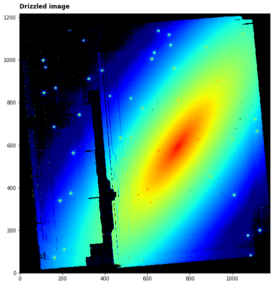
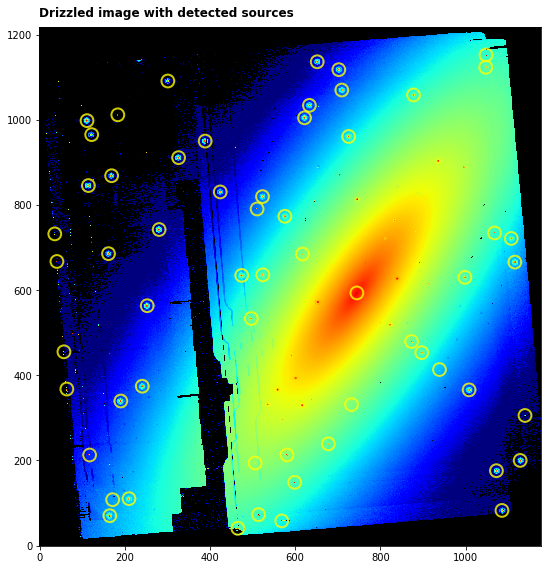

---
redirect_from:
  - "/level3-image3pipeline"
interact_link: content/Level3_Image3Pipeline.ipynb
kernel_name: python3
has_widgets: false
title: 'Level 3 Imager (CALIMAGE3)'
prev_page:
  url: /Level2_Image2Pipeline
  title: 'Level 2 Imager (CALIMAGE2)'
next_page:
  url: 
  title: ''
comment: "***PROGRAMMATICALLY GENERATED, DO NOT EDIT. SEE ORIGINAL FILES IN /content***"
---


## Image3Pipeline   (MIRI CALIMAGE3)

`Image3Pipeline` combines the calibrated data from multiple exposures (e.g. a dither or mosaic pattern) into a single rectified (distortion corrected) product. Before being combined, the exposures receive additional corrections for the purpose of astrometric alignment, background matching, and outlier rejection. 

Official documentation for `Image3Pipeline` can be found here:

<https://jwst-pipeline.readthedocs.io/en/latest/jwst/pipeline/calwebb_image3.html>

The `Image3Pipeline` comprises a linear series of steps. The steps applied to MIRI data in order are:

|Step|Description|
|:---|:---|
|`tweakreg`|refine the WCS solution by comparing source catalogues from input images|
|`skymatch`|compute sky values in a collection of input images that contain both sky and source signal|
|`outlier_detection`|identification of bad pixels or cosmic-rays that remain in each of the input images|
|`resample`|resample using WCS and distortion information into an undistorted product|
|`source_catalog`|resample using WCS and distortion information into an undistorted product|


For more information and examples of each of the steps click on the links in the side bar.


### Input data

An example of running the file through the `Image3Pipeline` is now shown using a simple simulated 4-point dither observation of a galaxy with the MIRI Imager (F1130W filter) produced with [MIRISim v2.1](http://miri.ster.kuleuven.be/bin/view/Public/MIRISimPublicRelease2dot1) and brought to level 2B using the `Detector1Pipeline` and `Image2Pipeline` modules. 


### Python

Start by importing what will be used and set the `CRDS_CONTEXT`


<div markdown="1" class="cell code_cell">
<div class="input_area" markdown="1">
```python
# imports
import os, glob, shutil
import numpy as np
from matplotlib.colors import LogNorm
import matplotlib.pyplot as plt
from subprocess import call
from jwst import datamodels
from jwst.associations.lib.member import Member
from jwst.associations.asn_from_list import asn_from_list
from astropy.table import Table
from photutils import CircularAperture

# set the CRDS_CONTEXT
os.environ["CRDS_CONTEXT"] = "jwst_0535.pmap"

```
</div>

</div>


`Image2Pipeline` can be run by passing indivual exposures or datamodels but in this sample case we produce an association file that links the background exposures to the science exposures so it can be subtracted. It is assumed that the science files are in 'IMA_science' and the background file is in 'IMA_background'. The content of the association file is printed for inspection.


<div markdown="1" class="cell code_cell">
<div class="input_area" markdown="1">
```python
# load the science and background files to lists
my_science_files = glob.glob('IMA_science/*cal.fits')
my_science_files = sorted(my_science_files)

# set the association name
asn_name = 'my_galaxy'

# setup an empty level 2 association structure
asn = asn_from_list(my_science_files, product_name=asn_name)

# set some metadata
asn['asn_pool'] = asn_name + '_pool'
asn['asn_type'] = 'image3'
        
# print the association and save to file
name, ser = asn.dump()
print(ser)

asn_file = asn_name + '_lvl3_asn.json'
with open(asn_file, 'w') as f:
    f.write(ser)

```
</div>

<div class="output_wrapper" markdown="1">
<div class="output_subarea" markdown="1">
{:.output_stream}
```
{
    "asn_type": "image3",
    "asn_rule": "DMS_Level3_Base",
    "version_id": null,
    "code_version": "0.13.7",
    "degraded_status": "No known degraded exposures in association.",
    "program": "noprogram",
    "constraints": "No constraints",
    "asn_id": "a3001",
    "target": "none",
    "asn_pool": "my_galaxy_pool",
    "products": [
        {
            "name": "my_galaxy",
            "members": [
                {
                    "expname": "IMA_science/my_galaxy_dither1_cal.fits",
                    "exptype": "science"
                },
                {
                    "expname": "IMA_science/my_galaxy_dither2_cal.fits",
                    "exptype": "science"
                },
                {
                    "expname": "IMA_science/my_galaxy_dither3_cal.fits",
                    "exptype": "science"
                },
                {
                    "expname": "IMA_science/my_galaxy_dither4_cal.fits",
                    "exptype": "science"
                }
            ]
        }
    ]
}
```
</div>
</div>
</div>


Import Image2Pipeline and print the docstring to show some information


<div markdown="1" class="cell code_cell">
<div class="input_area" markdown="1">
```python
from jwst.pipeline import Image3Pipeline
print(Image3Pipeline.__doc__)

```
</div>

<div class="output_wrapper" markdown="1">
<div class="output_subarea" markdown="1">
{:.output_stream}
```

    Image3Pipeline: Applies level 3 processing to imaging-mode data from
                    any JWST instrument.

    Included steps are:
        tweakreg
        skymatch
        outlier_detection
        resample
        source_catalog
    
```
</div>
</div>
</div>


The association file is passed as input. The output level 2B files will be saved in `my_output_dir` as `_cal.fits`. 

*Parameters used:*
    
`save_results`: boolean, optional, default=False  
&nbsp;&nbsp;&nbsp;&nbsp; save the results to file
    
`output_dir` : boolean, optional, default is the working directory   
&nbsp;&nbsp;&nbsp;&nbsp; the location to save the output
    
There are still some issues with the tweakreg step so this is skipped for now. We also set the source detection parameters and explicitly save the output from the `source_catalog` step.


<div markdown="1" class="cell code_cell">
<div class="input_area" markdown="1">
```python
# user specified
my_output_dir = 'demo_output'

# the output directory should be created if it doesn't exist
if not os.path.exists(my_output_dir): 
    os.mkdir(my_output_dir)

# run the pipeline
Image3Pipeline.call(asn_file, save_results=True, output_dir=my_output_dir,
                    steps={'tweakreg':{'skip':True},
                           'source_catalog':{'save_results':True, 'kernel_fwhm': 3.0, 'snr_threshold': 5.}})


```
</div>

</div>


We can plot the before (rate) and after (cal) images for the first dither position


<div markdown="1" class="cell code_cell">
<div class="input_area" markdown="1">
```python
driz_dm = datamodels.open(os.path.join(my_output_dir,'my_galaxy_i2d.fits'))

# plot--------------------------------------
fig, axs = plt.subplots(1, 1, figsize=(8, 8))

# show last frame of first integration
axs.imshow(driz_dm.data, cmap='jet', interpolation='nearest', origin='lower', norm=LogNorm(vmin=1,vmax=1000))
axs.annotate('Drizzled image', xy=(0.0, 1.02), xycoords='axes fraction', fontsize=12, fontweight='bold', color='k')
axs.set_facecolor('black')

plt.tight_layout()
plt.show()


```
</div>

<div class="output_wrapper" markdown="1">
<div class="output_subarea" markdown="1">

{:.output_png}


</div>
</div>
</div>


<div markdown="1" class="cell code_cell">
<div class="input_area" markdown="1">
```python
my_catalog = os.path.join(my_output_dir,'my_galaxy_cat.ecsv')
sources = Table.read(my_catalog, format='ascii.ecsv')

print(sources.columns)    # print all available column names
print()
sources['id', 'xcentroid', 'ycentroid', 'sky_centroid', 'abmag'].pprint(max_width=200)

```
</div>

<div class="output_wrapper" markdown="1">
<div class="output_subarea" markdown="1">
{:.output_stream}
```
<TableColumns names=('id','xcentroid','ycentroid','sky_centroid','area','source_sum','source_sum_err','semimajor_axis_sigma','semiminor_axis_sigma','orientation','sky_bbox_ll','sky_bbox_ul','sky_bbox_lr','sky_bbox_ur','orientation_sky','abmag','abmag_error')>

 id     xcentroid          ycentroid                      sky_centroid                      abmag       
           pix                pix                           deg,deg                                     
--- ------------------ ------------------ ------------------------------------------- ------------------
  1  465.3229934248459  40.60037660861897  0.008581976636042724,-0.016990404546913303 16.117643356323242
  2  568.3861471916999  57.92240326194591  0.005405088618397695,-0.016456458821157788 16.889514923095703
  3 164.78982345357352  70.18334474003645  0.017845813136668526,-0.016078518923121045 14.614348411560059
  4  513.9144049289938  72.67112137375418  0.007084162265779488,-0.016001834432487087 14.761037826538086
  5 1085.5606078568421  82.55518954133028     359.9894633552966,-0.015697160737656052 15.485074996948242
  6 171.44497078277416  107.8009201930857  0.017640670408669776,-0.014918969586790181 16.614788055419922
  7 209.78013744714897 110.19918839907851  0.016459001482017007,-0.014845043825857572 15.523670196533203
  8  598.7950450495879 148.51138970787832 0.0044677442824898024,-0.013664083127936438 15.600308418273926
  9 1072.5576976819314 175.84108704142716    359.98986416571734,-0.012821653753325413 15.000361442565918
 10  505.8490706614953 193.85317337219053  0.007332773559104245,-0.012266437530663081  16.80141830444336
...                ...                ...                                         ...                ...
 50  621.9428087953085 1004.4688375292691    0.003754222027469953,0.01272052498230544 15.004029273986816
 51 183.51179980773927 1011.4922441078658    0.01726871442220455,0.012937018879933034 15.440408706665039
 52   633.410548031909 1033.7627927940225   0.003400732712620937,0.013623501533610126 15.255057334899902
 53  877.8542705101311   1058.11533891363      359.9958658349106,0.014374160597026934  15.36843204498291
 54  709.4575134898878  1069.656334238728   0.001056609855247811,0.014729908127868388 15.078614234924316
 55 300.98439159765167  1090.890347544004   0.013647660295343719,0.015384439453617383 15.829872131347656
 56  702.4529711330578  1117.529699173802  0.0012725225829938922,0.016205588856373007 15.349252700805664
 57 1047.4535933350678 1123.1873444263458        359.9906379914119,0.0163799834399747 15.297553062438965
 58  651.7945513888352  1136.085660915966  0.0028340518156621526,0.016777570288986608 14.982636451721191
 59 1048.0397427417122 1152.0104343310657     359.99061992354706,0.017268445666020288 15.732965469360352
Length = 59 rows
```
</div>
</div>
</div>


<div markdown="1" class="cell code_cell">
<div class="input_area" markdown="1">
```python
# read source X,Y positions from the table, show with circles of radius 10pix
positions = (sources['xcentroid'], sources['ycentroid'])
apertures = CircularAperture(positions, r=15.)

# plot--------------------------------------
fig, axs = plt.subplots(1, 1, figsize=(8, 8))

# show last frame of first integration
axs.imshow(driz_dm.data, cmap='jet', interpolation='nearest', origin='lower', norm=LogNorm(vmin=1,vmax=1000))
apertures.plot(color='yellow', lw=2.0, alpha=0.8)
axs.annotate('Drizzled image with detected sources', xy=(0.0, 1.02), xycoords='axes fraction', fontsize=12, fontweight='bold', color='k')
axs.set_facecolor('black')

plt.tight_layout()
plt.show()

```
</div>

<div class="output_wrapper" markdown="1">
<div class="output_subarea" markdown="1">

{:.output_png}


</div>
</div>
</div>


### Command line

To achieve the same result from the command line there are a couple of options. However, one must still generate the association file. In this case, it is best to copy the template above into a text file and save it to `my_galaxy_lvl3_asn.json`. The content is printed here for convenience.


```python
{
    "asn_type": "image3",
    "asn_rule": "DMS_Level3_Base",
    "version_id": null,
    "code_version": "0.13.7",
    "degraded_status": "No known degraded exposures in association.",
    "program": "noprogram",
    "constraints": "No constraints",
    "asn_id": "a3001",
    "target": "none",
    "asn_pool": "my_galaxy_pool",
    "products": [
        {
            "name": "my_galaxy",
            "members": [
                {
                    "expname": "IMA_science/my_galaxy_dither1_cal.fits",
                    "exptype": "science"
                },
                {
                    "expname": "IMA_science/my_galaxy_dither2_cal.fits",
                    "exptype": "science"
                },
                {
                    "expname": "IMA_science/my_galaxy_dither3_cal.fits",
                    "exptype": "science"
                },
                {
                    "expname": "IMA_science/my_galaxy_dither4_cal.fits",
                    "exptype": "science"
                }
            ]
        }
    ]
}
```


**Option 1:**
Run the `Image3Pipeline` class using the `strun` command:

```bash
mkdir demo_output

strun jwst.pipeline.Image3Pipeline my_galaxy_lvl3_asn.json --output_dir demo_output
```

This will produce the same output file in the user-defined `--output_dir`


**Option 2:**
Collect the pipeline configuration files in your working directory (if they are not already there) using `collect_pipeline_configs` and then run the `Image3Pipeline` using the `strun` command with the associated `calwebb_image3.cfg` file. This option is a little more flexible as one can create edit the cfg files, use them again, etc.

```bash
mkdir demo_output

collect_pipeline_cfgs cfgs/

strun cfgs/calwebb_image3.cfg my_galaxy_lvl3_asn.json --output_dir demo_output
```

This will produce the same output file in the user-defined `--output_dir`


## Further examples

Other notebooks with more complex examples can be found here:

*To be added*

