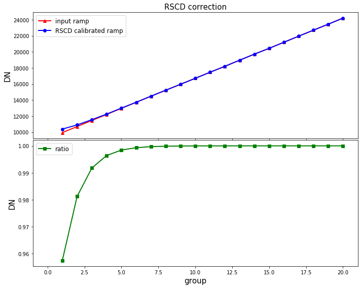

---
redirect_from:
  - "/rscd"
interact_link: content/RSCD.ipynb
kernel_name: python3
has_widgets: false
title: 'RSCD'
prev_page:
  url: /linearity
  title: 'linearity'
next_page:
  url: 
  title: ''
comment: "***PROGRAMMATICALLY GENERATED, DO NOT EDIT. SEE ORIGINAL FILES IN /content***"
---


## `rscd` step

For MIRI multiple integration data, the reset switch decay causes the the initial groups in integrations after the first one to be offset from their expected linear accumulation of signal. The most significant deviations occur in groups 1 and 2. This step corrects for these effects.

Official documentation for `rscd` can be found here:

<https://jwst-pipeline.readthedocs.io/en/latest/jwst/rscd/index.html>


### Input data

An example of running the `rscd` step is now shown using a simple simulated observation of a galaxy with the MIRI Imager (F1130W filter) produced with [MIRISim v2.1](http://miri.ster.kuleuven.be/bin/view/Public/MIRISimPublicRelease2dot1), with precending pipeline steps applied, i.e. `linearity` output.


### Python

Start by importing what will be used and set the `CRDS_CONTEXT`


<div markdown="1" class="cell code_cell">
<div class="input_area" markdown="1">
```python
# imports
import os, glob, shutil
import numpy as np
from matplotlib.colors import LogNorm
import matplotlib.pyplot as plt
from jwst import datamodels

# set the CRDS_CONTEXT
os.environ["CRDS_CONTEXT"] = "jwst_0535.pmap"

```
</div>

</div>


Import `rscd` and print the docstring and spec to show some information


<div markdown="1" class="cell code_cell">
<div class="input_area" markdown="1">
```python
# import the step
from jwst.rscd import rscd_step

# print the description and options
print(rscd_step.RSCD_Step.__doc__)
print(rscd_step.RSCD_Step.spec)


```
</div>

<div class="output_wrapper" markdown="1">
<div class="output_subarea" markdown="1">
{:.output_stream}
```

    RSCD_Step: Performs an RSCD correction to MIRI data by adding a function
    of time, frame by frame, to a copy of the input science data model.
    

    pre_hooks          = string_list(default=list())
    post_hooks         = string_list(default=list())
    output_file        = output_file(default=None)   # File to save output to.
    output_dir         = string(default=None)        # Directory path for output files
    output_ext         = string(default='.fits')     # Default type of output
    output_use_model   = boolean(default=False)      # When saving use `DataModel.meta.filename`
    output_use_index   = boolean(default=True)       # Append index.
    save_results       = boolean(default=False)      # Force save results
    skip               = boolean(default=False)      # Skip this step
    suffix             = string(default=None)        # Default suffix for output files
    search_output_file = boolean(default=True)       # Use outputfile define in parent step
    input_dir          = string(default=None)        # Input directory
    
```
</div>
</div>
</div>


Set the name of the input file and run the step. This will produce an output file ending with `_rscd_step.fits`

*Parameters used:*

`output_use_model` : boolean, optional, default=False  
&nbsp;&nbsp;&nbsp;&nbsp; propagate the input filename to the output
    
`save_results`: boolean, optional, default=False  
&nbsp;&nbsp;&nbsp;&nbsp; save the results to file

Note that the `rscd` will return the output datamodel so we set this to the `dm` variable.


<div markdown="1" class="cell code_cell">
<div class="input_area" markdown="1">
```python
# user specified
my_input_file = 'det_image_seq1_MIRIMAGE_F1130Wexp1_linearitystep.fits'

# run the step
dm = rscd_step.RSCD_Step.call(my_input_file, output_use_model=True, save_results=True)


```
</div>

</div>


Since `rscd` only applies a correction to integrations >1, we can check one of these to see the correction. If there is only one integration, then `rscd` doesn't do anything.


<div markdown="1" class="cell code_cell">
<div class="input_area" markdown="1">
```python
# set the sample pixel
pixel = [600,500]

# define group numbers for integration ramps
group = range(1,dm.data[0,:,pixel[0],pixel[1]].shape[0]+1,1)

# open the input file as a datamodel
in_dm = datamodels.open(my_input_file)

# first check that there is more than one integration
if dm.data.shape[0] > 1:

    # plot
    fig, axs = plt.subplots(2, 1, figsize=(10, 8), sharex=True)

    # plot input and output ramps of the second integration
    axs[0].plot(group, in_dm.data[-1,:,pixel[1],pixel[0]], c='r', marker='^', markersize=6, 
                linestyle='-', linewidth=2, label='input ramp')
    axs[0].plot(group, dm.data[-1,:,pixel[1],pixel[0]], c='b', marker='o', linestyle='-', 
                linewidth=2, label='RSCD calibrated ramp')
    axs[0].set_title('RSCD correction',fontsize=15)
    axs[0].set_ylabel('DN',fontsize=15)
    axs[0].set_xlim(-1,max(group)+1)
    axs[0].legend(prop={'size':12}, loc=0)

    # plot ratio between the two
    axs[1].plot(group, in_dm.data[-1,:,pixel[1],pixel[0]] / dm.data[-1,:,pixel[1],pixel[0]], c='g', 
                marker='s', markersize=6, linestyle='-', linewidth=2, label='ratio')
    axs[1].set_ylabel('DN',fontsize=15)
    axs[1].set_xlabel('group',fontsize=15)
    axs[1].legend(prop={'size':12}, loc=0)

    plt.tight_layout(h_pad=0)
    plt.show()

else: 
    print("RSCD step only operates on exposures with more than one integration.")


```
</div>

<div class="output_wrapper" markdown="1">
<div class="output_subarea" markdown="1">

{:.output_png}


</div>
</div>
</div>


### Command line

To achieve the same result from the command line there are a couple of options. 

**Option 1:**
Run the `RSCD_Step` class using the `strun` command:

```bash
strun jwst.rscd.RSCD_Step det_image_seq1_MIRIMAGE_F1130Wexp1_linearitystep.fits
```

**Option 2:**
If they don't already exist, collect the pipeline configuration files in your working directory using `collect_pipeline_configs` and then run the `RSCD_Step` using the `strun` command with the associated `rscd.cfg` file. 

```bash
collect_pipeline_cfgs cfgs/

strun cfgs/rscd.cfg det_image_seq1_MIRIMAGE_F1130Wexp1_linearitystep.fits
```

This will produce the same output file ending with `_rscd_step.fits` 


A full list of the command line options are given by running the following:

```bash
strun jwst.rscd.RSCD_Step -h
```

or 

```bash
strun cfgs/rscd.cfg -h
```


### Override reference file

To override the reference file for this step in Python:


```python
# set the override reference file name
my_ref = 'my_rscd.fits'

dm = rscd.RSCD_Step.call(my_input_file, output_use_model=True, save_results=True, 
                         override_rscd=my_ref)
```


and using the command line:

```bash
strun jwst.rscd.RSCD_Step det_image_seq1_MIRIMAGE_F1130Wexp1_linearitystep.fits  --override_rscd my_rscd.fits
```

or

```bash
strun cfgs/rscd.cfg det_image_seq1_MIRIMAGE_F1130Wexp1_linearitystep.fits --override_rscd my_rscd.fits
```

