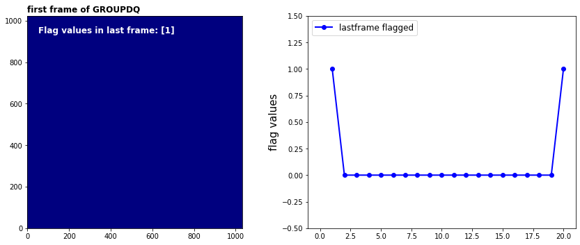

## `lastframe` step

This step flags the final group as bad if the number of groups is greater than 3. No correction or flagging is done otherwise.

Official documentation for `lastframe` can be found here:

<https://jwst-pipeline.readthedocs.io/en/latest/jwst/lastframe/index.html>


### Input data

An example of running the `lastframe` step is now shown using a simple simulated observation of a galaxy with the MIRI Imager (F1130W filter) produced with [MIRISim v2.1](http://miri.ster.kuleuven.be/bin/view/Public/MIRISimPublicRelease2dot1), with precending pipeline steps applied, i.e. `firstframe` output.


### Python

Start by importing what will be used and set the `CRDS_CONTEXT`


<div markdown="1" class="cell code_cell">
<div class="input_area" markdown="1">
```python
# imports
import os, glob, shutil
import numpy as np
from matplotlib.colors import LogNorm
import matplotlib.pyplot as plt
from jwst import datamodels

# set the CRDS_CONTEXT
os.environ["CRDS_CONTEXT"] = "jwst_0535.pmap"

```
</div>

</div>


Import `lastframe` and print the docstring and spec to show some information


<div markdown="1" class="cell code_cell">
<div class="input_area" markdown="1">
```python
#import the step
from jwst.lastframe import lastframe_step

# print the description and options
print(lastframe_step.LastFrameStep.__doc__)
print(lastframe_step.LastFrameStep.spec)

```
</div>

<div class="output_wrapper" markdown="1">
<div class="output_subarea" markdown="1">
{:.output_stream}
```

    LastFrameStep: This is a MIRI specific task.  If the number of groups
    is greater than 2, the GROUP data quality flags for the final group will
    be set to DO_NOT_USE.
    

    pre_hooks          = string_list(default=list())
    post_hooks         = string_list(default=list())
    output_file        = output_file(default=None)   # File to save output to.
    output_dir         = string(default=None)        # Directory path for output files
    output_ext         = string(default='.fits')     # Default type of output
    output_use_model   = boolean(default=False)      # When saving use `DataModel.meta.filename`
    output_use_index   = boolean(default=True)       # Append index.
    save_results       = boolean(default=False)      # Force save results
    skip               = boolean(default=False)      # Skip this step
    suffix             = string(default=None)        # Default suffix for output files
    search_output_file = boolean(default=True)       # Use outputfile define in parent step
    input_dir          = string(default=None)        # Input directory
    
```
</div>
</div>
</div>


Set the name of the input file and run the step. This will produce an output file ending with `_lastframestep.fits`

*Parameters used:*

`output_use_model` : boolean, optional, default=False  
&nbsp;&nbsp;&nbsp;&nbsp; propagate the input filename to the output
    
`save_results`: boolean, optional, default=False  
&nbsp;&nbsp;&nbsp;&nbsp; save the results to file

Note that the `firstframe` will return the output datamodel so we set this to the `dm` variable.


<div markdown="1" class="cell code_cell">
<div class="input_area" markdown="1">
```python
# user specified
my_input_file = 'det_image_seq1_MIRIMAGE_F1130Wexp1_firstframestep.fits'

# run the step
dm = lastframe_step.LastFrameStep.call(my_input_file, output_use_model=True, save_results=True)


```
</div>

</div>


We can plot the GROUPDQ last frame image and the GROUPDQ 1D array for a sample pixel to check the step has flagged the last frame in the ramps with a value of 1


<div markdown="1" class="cell code_cell">
<div class="input_area" markdown="1">
```python
# set the sample pixel
pixel = [688,511]

# define group numbers for integration ramps
group = range(1,dm.data[0,:,pixel[0],pixel[1]].shape[0]+1,1)

# plot
fig, axs = plt.subplots(1, 2, figsize=(12, 5))

# plot the first frame of the first integration of the GROUPDQ extension
axs[0].imshow(dm.groupdq[0][-1], cmap='jet', interpolation='nearest', origin='lower')
axs[0].annotate('first frame of GROUPDQ', xy=(0.0, 1.02), xycoords='axes fraction', 
                fontsize=12, fontweight='bold', color='k')

# determine the values in this GROUPDQ frame
flag_values = np.unique(dm.groupdq[0][-1])
axs[0].annotate('Flag values in last frame: %s' % flag_values, xy=(0.05, 0.92), 
                xycoords='axes fraction', fontsize=12, fontweight='bold', color='w')

# input and output ramps (setting a slight offset for the output ramp)
axs[1].plot(group, dm.groupdq[-1,:,pixel[1],pixel[0]], c='b', marker='o', linestyle='-', 
            linewidth=2, label='lastframe flagged')

axs[1].set_ylabel('flag values',fontsize=15)
axs[1].set_xlim(-1,max(group)+1)
axs[1].set_ylim(-0.5,1.5)
axs[1].legend(prop={'size':12}, loc=2)

plt.tight_layout(h_pad=0)
plt.show()

```
</div>

<div class="output_wrapper" markdown="1">
<div class="output_subarea" markdown="1">

{:.output_png}


</div>
</div>
</div>


### Command line

To achieve the same result from the command line there are a couple of options. 

**Option 1:**
Run the `LastFrameStep` class using the `strun` command:

```bash
strun jwst.lastframe.LastFrameStep det_image_seq1_MIRIMAGE_F1130Wexp1_firststep.fits
```

**Option 2:**
If they don't already exist, collect the pipeline configuration files in your working directory using `collect_pipeline_configs` and then run the `LastFrameStep` using the `strun` command with the associated `lastframe.cfg` file. 

```bash
collect_pipeline_cfgs cfgs/

strun cfgs/lastframe.cfg det_image_seq1_MIRIMAGE_F1130Wexp1_firstframestep.fits
```

This will produce the same output file ending with `_lastframestep.fits` 


A full list of the command line options are given by running the following:

```bash
strun jwst.lastframe.LastFrameStep -h
```

or 

```bash
strun cfgs/lastframe.cfg -h
```


### Override reference file

There is currently no reference file for the lastframe step.

